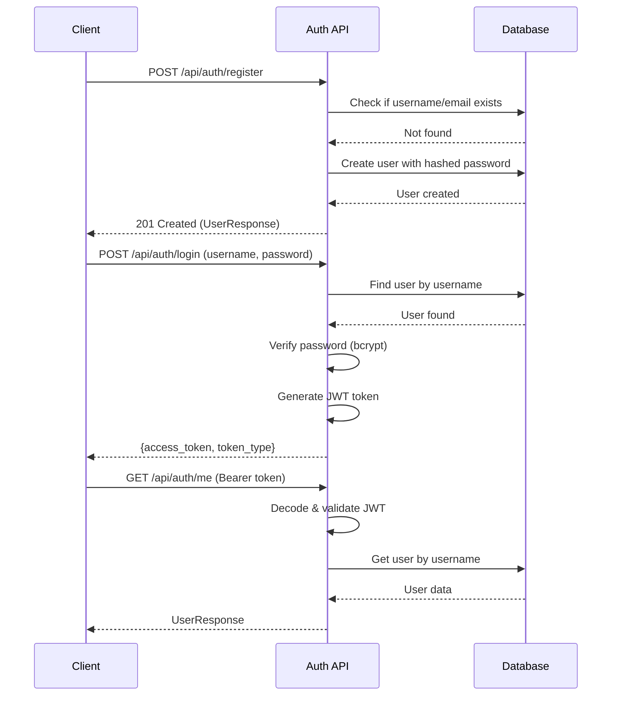

# Authentication API Documentation

## Overview

The Ruman platform uses **JWT (JSON Web Tokens)** for authentication with role-based access control (RBAC).

---

## Authentication Flow



---

## Endpoints

### 1. Register New User

**POST** `/api/auth/register`

Register a new user account.

**Request Body:**
```json
{
  "username": "john_doe",
  "email": "john@example.com",
  "password": "secure123",
  "role": "student"
}
```

**Validation:**
- `username`: 3-50 characters, unique
- `email`: Valid email format, unique
- `password`: Minimum 6 characters
- `role`: Must be `"admin"`, `"teacher"`, or `"student"`

**Response (201 Created):**
```json
{
  "id": 4,
  "username": "john_doe",
  "email": "john@example.com",
  "role": "student",
  "is_active": true,
  "created_at": "2026-01-16T15:30:00"
}
```

**Errors:**
- `400 Bad Request`: Username/email already exists, weak password
- `422 Unprocessable Entity`: Validation error

---

### 2. Login

**POST** `/api/auth/login`

Authenticate and receive JWT access token.

**Request (Form Data - OAuth2PasswordRequestForm):**
```
username: admin
password: admin123
```

**Response (200 OK):**
```json
{
  "access_token": "eyJhbGciOiJIUzI1NiIsInR5cCI6IkpXVCJ9...",
  "token_type": "bearer"
}
```

**Token Payload:**
```json
{
  "sub": "admin",
  "role": "admin",
  "exp": 1705420800
}
```

**Token Expiry:** 30 minutes (configurable in `settings.ACCESS_TOKEN_EXPIRE_MINUTES`)

**Errors:**
- `401 Unauthorized`: Incorrect username or password
- `403 Forbidden`: User account is inactive

---

### 3. Get Current User

**GET** `/api/auth/me`

Get information about the currently authenticated user.

**Headers:**
```
Authorization: Bearer <access_token>
```

**Response (200 OK):**
```json
{
  "id": 1,
  "username": "admin",
  "email": "admin@ruman.ai",
  "role": "admin",
  "is_active": true,
  "created_at": "2026-01-16T12:00:00"
}
```

**Errors:**
- `401 Unauthorized`: Invalid or expired token
- `403 Forbidden`: User account inactive

---

### 4. Refresh Token

**POST** `/api/auth/refresh`

Get a new access token with extended expiry.

**Headers:**
```
Authorization: Bearer <access_token>
```

**Response (200 OK):**
```json
{
  "access_token": "eyJhbGciOiJIUzI1NiIsInR5cCI...",
  "token_type": "bearer"
}
```

---

## Role-Based Access Control (RBAC)

### Available Dependencies

Use these FastAPI dependencies to protect endpoints:

#### 1. `get_current_user`
Any authenticated user (admin, teacher, or student).

```python
from routes.auth import get_current_user

@router.get("/profile")
def get_profile(current_user: User = Depends(get_current_user)):
    return {"user": current_user.username}
```

#### 2. `get_current_admin`
Admin users only.

```python
from routes.auth import get_current_admin

@router.get("/admin/dashboard")
def admin_dashboard(current_admin: User = Depends(get_current_admin)):
    return {"message": "Admin only"}
```

Returns `403 Forbidden` if user is not an admin.

#### 3. `get_current_teacher`
Teachers and admins.

```python
from routes.auth import get_current_teacher

@router.post("/courses")
def create_course(current_teacher: User = Depends(get_current_teacher)):
    return {"teacher": current_teacher.username}
```

#### 4. `get_current_student`
Students only.

```python
from routes.auth import get_current_student

@router.get("/student/progress")
def get_progress(current_student: User = Depends(get_current_student)):
    return {"student": current_student.username}
```

---

## Admin Management Endpoints

**Base URL:** `/api/admin` (All require admin authentication)

### List All Users
**GET** `/api/admin/users?skip=0&limit=100`

### Get User by ID
**GET** `/api/admin/users/{user_id}`

### Activate User
**PUT** `/api/admin/users/{user_id}/activate`

### Deactivate User
**PUT** `/api/admin/users/{user_id}/deactivate`

### Delete User
**DELETE** `/api/admin/users/{user_id}`

### Create User (as Admin)
**POST** `/api/admin/users`

---

## Security Features

### Password Hashing
- **Algorithm:** bcrypt with 12 rounds
- Passwords are **never** stored in plain text
- Salt automatically generated per password

### JWT Tokens
- **Algorithm:** HS256 (HMAC with SHA-256)
- **Secret Key:** Loaded from environment variable
- **Expiry:** 30 minutes (auto-logout on expiry)
- **Payload:** Contains `username`, `role`, and `exp` (expiration time)

### Protection Against
- ✅ **SQL Injection**: SQLAlchemy ORM prevents injection
- ✅ **Password Cracking**: bcrypt is computationally expensive
- ✅ **Token Tampering**: HMAC signature validates authenticity
- ✅ **Brute Force**: Can add rate limiting (future enhancement)

---

## Usage Examples

### Example 1: Register and Login (Python)

```python
import requests

BASE_URL = "http://localhost:8000/api/auth"

# Register
register_data = {
    "username": "alice",
    "email": "alice@example.com",
    "password": "alice123",
    "role": "teacher"
}
response = requests.post(f"{BASE_URL}/register", json=register_data)
print(response.json())

# Login
login_data = {"username": "alice", "password": "alice123"}
response = requests.post(f"{BASE_URL}/login", data=login_data)
token = response.json()["access_token"]

# Access protected endpoint
headers = {"Authorization": f"Bearer {token}"}
response = requests.get(f"{BASE_URL}/me", headers=headers)
print(response.json())
```

### Example 2: Using Token in JavaScript

```javascript
// Login
const loginResponse = await fetch('http://localhost:8000/api/auth/login', {
  method: 'POST',
  headers: { 'Content-Type': 'application/x-www-form-urlencoded' },
  body: 'username=admin&password=admin123'
});

const { access_token } = await loginResponse.json();

// Use token
const meResponse = await fetch('http://localhost:8000/api/auth/me', {
  headers: { 'Authorization': `Bearer ${access_token}` }
});

const user = await meResponse.json();
console.log(user);
```

---

## Testing

### Interactive API Docs (Swagger UI)
Visit: **http://localhost:8000/docs**

1. Click "Authorize" button (🔒)
2. Login to get token
3. Enter token in format: `Bearer <token>`
4. Test all endpoints interactively

### Automated Test Script
```bash
python test_auth.py
```

This tests registration, login, token validation, and error handling.

---

## Default Users (After DB Initialization)

| Username | Password | Role | Use Case |
|----------|----------|------|----------|
| `admin` | `admin123` | admin | Full system access, user management |
| `teacher1` | `teacher123` | teacher | Create courses, quizzes, chatbots |
| `student1` | `student123` | student | Enroll in courses, take quizzes |

⚠️ **Change these passwords in production!**

---

## Troubleshooting

### "Could not validate credentials"
- Token expired (30 min limit) → Login again
- Invalid token format → Ensure `Bearer <token>`
- Secret key mismatch → Check `.env` file

### "Incorrect username or password"
- Verify credentials
- Check if user exists: `GET /api/admin/users` (as admin)
- Ensure password has min 6 characters

### "User account is inactive"
- Admin has deactivated the account
- Contact admin to reactivate: `PUT /api/admin/users/{id}/activate`
