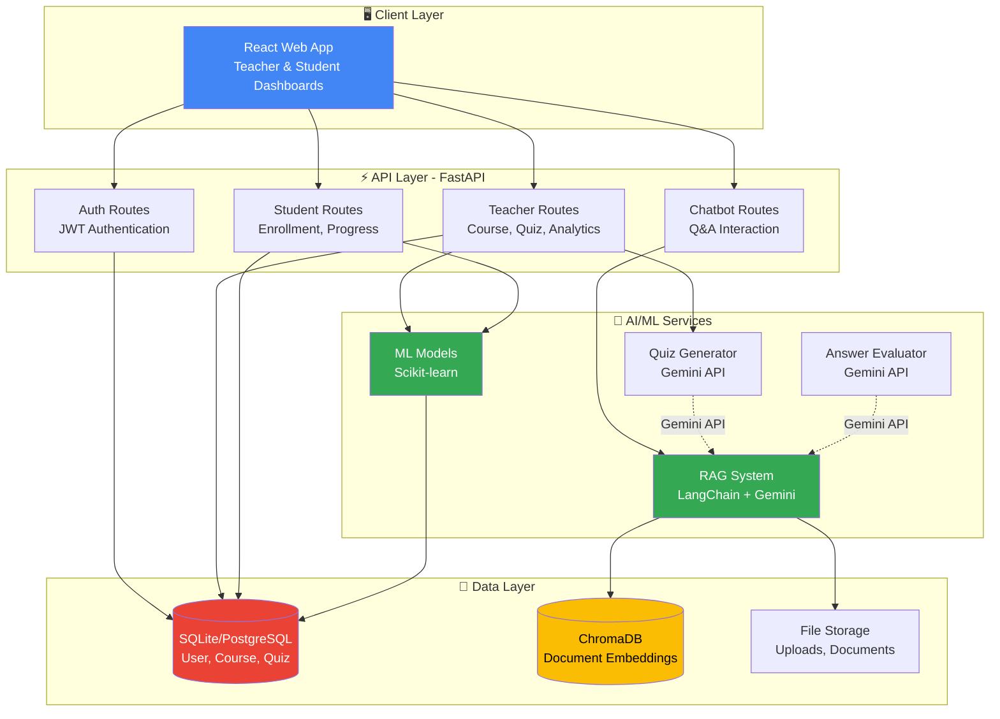

# Ruman AI Learning Platform - System Architecture

## Overview

Ruman is a full-stack AI-powered personalized learning platform designed for educational institutions. It provides separate interfaces for teachers and students, with AI-driven features including RAG-based chatbots, automated assessment, performance prediction, and gamification.

---

## Technology Stack

### Frontend
- **Framework**: React 18 + Vite
- **Routing**: React Router v6
- **State Management**: React Context API / Zustand
- **HTTP Client**: Axios
- **UI Library**: Tailwind CSS / Material-UI
- **Charts**: Recharts / Chart.js

### Backend
- **Framework**: FastAPI (Python 3.10+)
- **ORM**: SQLAlchemy 2.0
- **Database**: SQLite (dev) / PostgreSQL (production)
- **Authentication**: JWT (python-jose)
- **Password Hashing**: bcrypt (passlib)

### AI/ML Services
- **LLM**: Google Gemini API (`gemini-1.5-pro`)
- **RAG Framework**: LangChain
- **Vector Database**: ChromaDB
- **Embeddings**: sentence-transformers (`all-MiniLM-L6-v2`)
- **ML Library**: Scikit-learn
- **Data Processing**: Pandas, NumPy

### Infrastructure
- **Development Server**: Uvicorn
- **File Storage**: Local filesystem (uploads/)
- **Environment**: python-dotenv

---

## System Architecture Diagram



---

## Component Architecture

### 1. **Frontend (React)**

```
frontend/
├── public/
├── src/
│   ├── components/
│   │   ├── auth/
│   │   │   ├── LoginForm.jsx
│   │   │   └── RegisterForm.jsx
│   │   ├── teacher/
│   │   │   ├── CourseManager.jsx
│   │   │   ├── QuizBuilder.jsx
│   │   │   ├── ChatbotCreator.jsx
│   │   │   └── AnalyticsDashboard.jsx
│   │   ├── student/
│   │   │   ├── Dashboard.jsx
│   │   │   ├── QuizTaker.jsx
│   │   │   ├── Chatbot.jsx
│   │   │   └── ProgressView.jsx
│   │   └── shared/
│   │       ├── Navbar.jsx
│   │       └── Loading.jsx
│   ├── pages/
│   │   ├── Home.jsx
│   │   ├── TeacherDashboard.jsx
│   │   └── StudentDashboard.jsx
│   ├── services/
│   │   ├── api.js          # Axios instance
│   │   ├── authService.js
│   │   └── courseService.js
│   ├── hooks/
│   │   ├── useAuth.js
│   │   └── useCourse.js
│   ├── App.jsx
│   └── main.jsx
└── vite.config.js
```

**Key Features**:
- Role-based routing (admin/teacher/student)
- Real-time chat interface for AI tutors
- Interactive quiz builder with drag-drop
- Charts for performance analytics

---

### 2. **Backend (FastAPI)**

```
backend/
├── routes/
│   ├── auth.py          # Registration, Login, JWT
│   ├── teacher.py       # Course, Quiz, Chatbot CRUD
│   ├── student.py       # Enrollment, Progress, Submission
│   └── admin.py         # User management
├── ai_services/
│   ├── rag_system.py    # RAG implementation
│   ├── ml_models.py     # Performance prediction
│   ├── quiz_generator.py
│   └── answer_evaluator.py
├── models.py            # SQLAlchemy ORM models
├── schemas.py           # Pydantic validation
├── database.py          # DB session management
├── config.py            # Settings & env vars
├── app.py               # Main FastAPI app
└── init_db.py           # DB initialization script
```

**API Endpoints**:

#### Authentication
- `POST /api/auth/register` - Register new user
- `POST /api/auth/login` - Login and get JWT token
- `GET /api/auth/me` - Get current user

#### Teacher Routes
- `POST /api/teacher/courses` - Create course
- `GET /api/teacher/courses` - List teacher's courses
- `POST /api/teacher/courses/{id}/chatbot` - Create chatbot
- `POST /api/teacher/courses/{id}/quiz` - Create quiz
- `GET /api/teacher/analytics/{course_id}` - Get analytics

#### Student Routes
- `GET /api/student/courses` - List enrolled courses
- `POST /api/student/quiz/{id}/attempt` - Start quiz attempt
- `POST /api/student/quiz/attempt/{id}/submit` - Submit quiz
- `POST /api/student/chatbot/{id}/query` - Ask chatbot
- `GET /api/student/progress` - Get progress & gamification

---

### 3. **AI/ML Services**

#### RAG System (`rag_system.py`)
```python
class RAGSystem:
    - load_documents(files) 
    - chunk_and_embed(documents)
    - store_in_chroma(chunks)
    - query(question, chatbot_id)
        → retrieve_context(k=5)
        → generate_answer(context + question)
```

**Data Flow**:
1. Teacher uploads PDF/TXT to chatbot
2. System splits into 512-token chunks
3. Generate embeddings (sentence-transformers)
4. Store in ChromaDB collection
5. Student queries → retrieve relevant chunks → Gemini generates answer

#### ML Models (`ml_models.py`)
```python
class PerformancePredictor:
    - train(student_data)
    - predict_risk(student_id) → Low/Medium/High
    - predict_grade(student_id) → 0-100

class LearningGapAnalyzer:
    - cluster_students(course_id)
    - identify_weak_topics()
    - recommend_topics(student_id)
```

---

## Database Schema

### Core Tables
1. **users** - Authentication & roles
2. **courses** - Teacher-created courses
3. **enrollments** - Student-course mapping

### AI/Chatbot
4. **chatbots** - RAG chatbot instances
5. **chatbot_documents** - Uploaded files
6. **chat_messages** - Conversation history

### Assessments
7. **quizzes** - Quiz metadata
8. **quiz_questions** - Question bank
9. **quiz_attempts** - Student attempts
10. **assignments** - Homework assignments
11. **submissions** - Student submissions

### Gamification
12. **student_progress** - XP, levels, badges
13. **achievements** - Badge definitions
14. **activity_log** - Analytics tracking

See `database/schema.sql` for full DDL.

---

## Data Flow Examples

### 1. Student Takes Quiz
```
Student → POST /api/student/quiz/1/attempt
      ↓
Create QuizAttempt record (started_at)
      ↓
Return quiz questions (without answers)
      ↓
Student submits answers → POST /api/student/quiz/attempt/1/submit
      ↓
Evaluate answers (ML for short-answer)
      ↓
Store score, update QuizAttempt (completed_at)
      ↓
Award XP, check achievements
      ↓
Return results + feedback
```

### 2. Teacher Creates AI Chatbot
```
Teacher → Upload PDF + create chatbot (POST /api/teacher/courses/1/chatbot)
      ↓
Save file to uploads/
      ↓
Extract text from PDF (pypdf)
      ↓
Split into chunks (LangChain RecursiveCharacterTextSplitter)
      ↓
Generate embeddings (sentence-transformers)
      ↓
Store in ChromaDB collection
      ↓
Save chatbot metadata to DB
      ↓
Return chatbot_id
```

### 3. Student Asks Chatbot
```
Student → POST /api/student/chatbot/5/query {"question": "What is..."}
      ↓
Embed question (sentence-transformers)
      ↓
Search ChromaDB for similar chunks (top_k=5)
      ↓
Build prompt: system_prompt + context + question
      ↓
Send to Gemini API
      ↓
Parse response
      ↓
Save to chat_messages (user + assistant)
      ↓
Return answer
```

---

## Security Architecture

### Authentication Flow
1. User sends credentials → `POST /api/auth/login`
2. Server validates password (bcrypt)
3. Generate JWT token (HS256, 30min expiry)
4. Client stores token in localStorage
5. All requests include `Authorization: Bearer <token>`
6. Backend validates token via `get_current_user()` dependency

### Role-based Access Control (RBAC)
```python
@router.post("/teacher/courses")
async def create_course(
    current_user: User = Depends(get_current_teacher)
):
    # Only accessible by teachers/admins
```

### Data Protection
- Passwords hashed with bcrypt (12 rounds)
- JWT secret key from environment variable
- SQL injection prevented by SQLAlchemy ORM
- File upload validation (type, size)

---

## Deployment Architecture

### Development
```
http://localhost:8000      → FastAPI backend
http://localhost:5173      → React frontend (Vite dev server)
SQLite file: ./ruman.db
ChromaDB: ./chroma_db/
```

### Production (Example)
```
Frontend: Vercel / Netlify
Backend: Cloud Run / Railway / Render
Database: PostgreSQL (Supabase / Neon)
ChromaDB: Self-hosted or Chroma Cloud
File Storage: AWS S3 / Google Cloud Storage
```

---

## Performance Optimizations

1. **Database Indexing**: All foreign keys and frequently queried columns
2. **Connection Pooling**: SQLAlchemy session management
3. **Caching**: ChromaDB persists embeddings to disk
4. **Lazy Loading**: React code splitting
5. **Pagination**: Limit query results (e.g., 20 courses per page)

---

## Monitoring & Logging

- FastAPI automatic API docs: `/docs` (Swagger UI)
- Database queries logged in development (`echo=True`)
- Activity log table tracks all user actions
- Error handling with proper HTTP status codes

---

## Future Enhancements

1. **Real-time Notifications**: WebSocket for chat, quiz results
2. **Multi-tenancy**: Support multiple schools/organizations
3. **Mobile Apps**: React Native for iOS/Android
4. **Advanced Analytics**: Tableau/Metabase integration
5. **Video Support**: Video lectures with AI-generated transcripts
6. **Peer Learning**: Student discussion forums
7. **Parent Portal**: Progress reports for parents
8. **CI/CD Pipeline**: Automated testing and deployment
